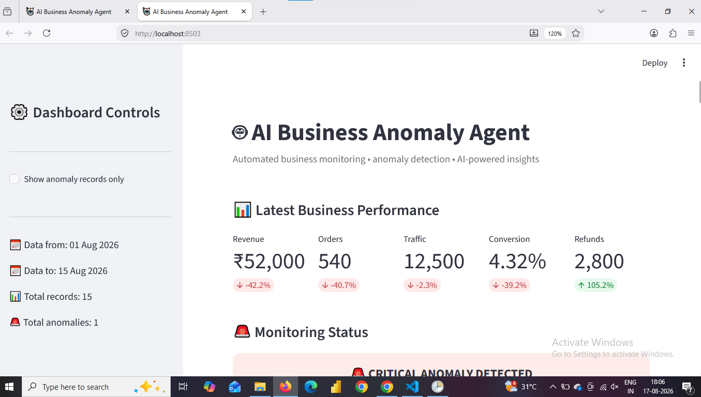

# 🤖 AI Business Anomaly Agent
## 📊 Dashboard Preview



An AI-powered business monitoring system that automatically analyzes business data, detects unusual changes, generates business insights using Gemini AI, and sends email alerts.

---

## 📌 Project Overview

Traditional dashboards show what happened.

This project goes one step further.

The AI Business Anomaly Agent continuously monitors business metrics and identifies unusual changes before they become bigger business problems.

The system can:

- Read business data
- Calculate metric changes
- Compare current values with historical baselines
- Detect anomalies
- Determine anomaly severity
- Generate AI-powered business explanations
- Send email alerts
- Maintain alert history
- Display results through an interactive dashboard

---

## 🎯 Business Problem

Business teams often depend on manually checking spreadsheets and dashboards.

This creates several problems:

- Important changes can be missed
- Manual monitoring takes time
- Managers may discover problems too late
- Raw numbers do not always explain what happened

This project solves the problem by automatically monitoring important business metrics and notifying the user when unusual behavior is detected.

---

## 🚀 Key Features

### 1. Automated Data Monitoring

The system reads business data from CSV files.

### 2. Anomaly Detection

The agent compares current metrics with a historical baseline.

Metrics monitored include:

- Revenue
- Orders
- Traffic
- Conversion Rate
- Cost
- Refunds

### 3. Severity Detection

Detected anomalies are classified as:

- Normal
- Low
- Medium
- Critical

### 4. Gemini AI Analysis

Gemini analyzes the detected anomaly and generates:

- What happened
- Possible causes
- Business impact
- Recommended actions

### 5. Email Alerts

When a serious anomaly is detected, the system sends an email notification.

### 6. Duplicate Alert Prevention

The system checks alert history before sending another email for the same anomaly.

### 7. Interactive Dashboard

The Streamlit dashboard provides:

- KPI cards
- Revenue trend
- Metric changes
- Revenue vs Cost
- Anomaly history
- AI analysis
- Email alert history

### 8. Report Download

Users can download the anomaly report as a CSV file.

---

## 🧠 System Architecture

```text
Business Data
     |
     v
Data Cleaning
     |
     v
Historical Baseline
     |
     v
Anomaly Detection
     |
     v
Severity Classification
     |
     +----------------------+
     |                      |
     v                      v
Gemini AI              Email Alert
     |                      |
     v                      v
Business Insight       Alert History
     |
     v
Streamlit Dashboard